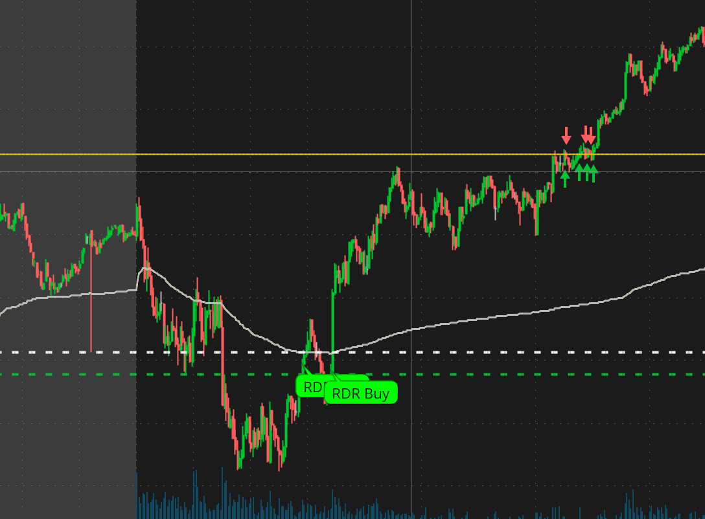
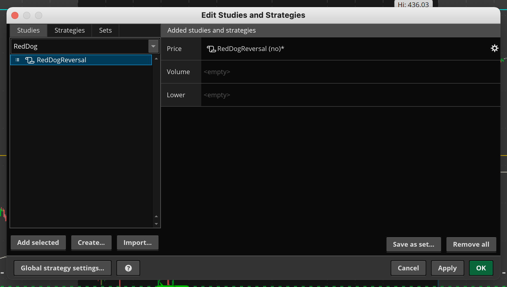
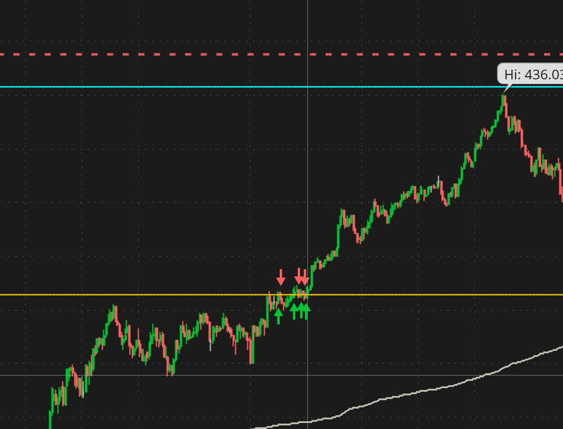
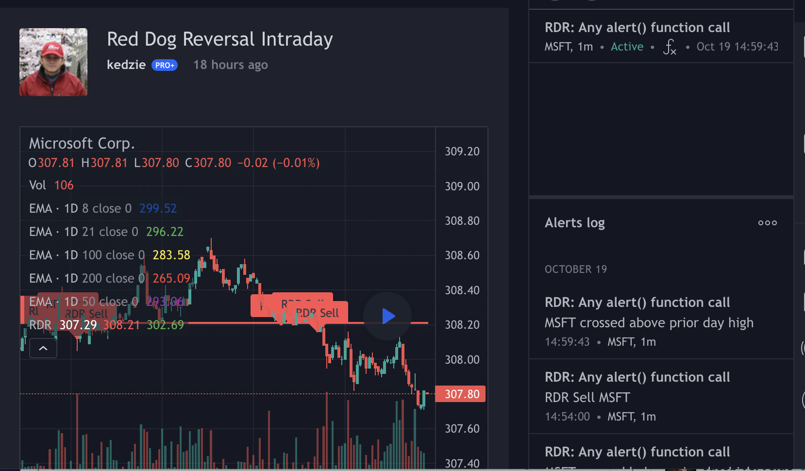
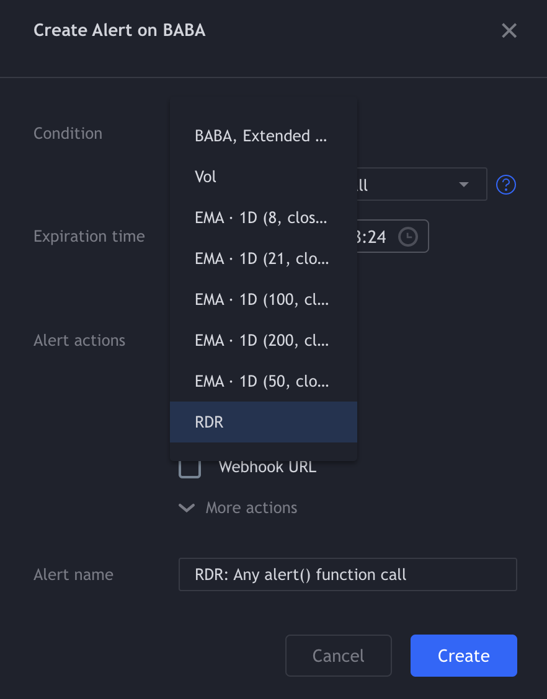

# Trading Scripts

Many related to RedDogReversal (RDR) - See [Scott Redler](https://twitter.com/RedDogT3) @ [T3 Live](http://www.t3live.com)

1. TOS
	1. [RedDogReversal](#RedDogReversal)
	1. [MovAvgExponentialVariablePeriod](#MovAvgExponentialVariablePeriod)
2. TradingView
	1. [RedDogReversal](#RedDogReversal-pinescript)

## Thinkscript (ThinkOrSwim)

Many related to RedDogReversal (RDR)  (See [Scott Redler](https://twitter.com/RedDogT3) @ [T3 Live](http://www.t3live.com)

### RedDogReversal

[Add to TOS](https://tos.mx/hLFjcVl)

Alerts and bubbles for Red Dog Reversal (RDR) Buy/Sell on intraday chart.  Optionally plots prior day High/Low/Close and alerts on crosses of those prior levels.

#### Configuration

Add as Study on main chart.  Enable alerts on crossover of prior day HLC, and Reversals if desired.   For plots of prior levels you must enable each one as they are disabled by default.

### MovAvgExponentialVariablePeriod

[Add to TOS](https://tos.mx/Qinrit9)

Will show daily EMA on intraday chart so you can trade against it.  Alerts on when price crosses levels.

#### Configuration

Add as Study on main chart.  Set the period you want the ema for, i.e. 8 day, 21 day, 50 day.  

## Pine script (TradingView)

### RedDogReversal pinescript

[Add to TradingView](https://www.tradingview.com/script/YjLdK0s0-Red-Dog-Reversal-Intraday/)

Alerts and bubbles for Red Dog Reversal (RDR) Buy/Sell on intraday chart.  Optionally plots prior day High/Low/Close and alerts on crosses of those prior levels.  *(Same as the thinkscript version above)*

#### Configuration

Add to chart and enable plots to show prior levels.  For alerts you must create an alert and choose RDR

