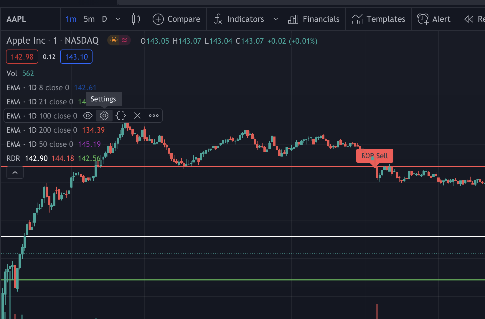

# Trading Scripts

Many related to RedDogReversal (RDR)  (See [Scott Redler](https://twitter.com/RedDogT3) @ [T3 Live](http://www.t3live.com)

1. TOS
	1. [RedDogReversal](#RedDogReversal)
	1. [PriorDayLevelWithRDR](#PriorDayLevelWithRDR)
	1. [MovAvgExponentialVariablePeriod](#MovAvgExponentialVariablePeriod)
2. TradingView
	1. [RedDogReversal](RedDogReversal pinescript#RedDogReversal pinescript)

## Thinkscript (ThinkOrSwim)

Many related to RedDogReversal (RDR)  (See [Scott Redler](https://twitter.com/RedDogT3) @ [T3 Live](http://www.t3live.com)

### RedDogReversal

[Add to TOS](https://tos.mx/hLFjcVl)

This combines just the RedDogReversal Buy/Sell in a single script.  All you need to do is add it and get alerts and bubbles for RDR sell/buy.  Also has optional plots for prior day's high/low/close levels.

### PriorDayLevelWithRDR

[Add to TOS](https://tos.mx/GgiDSsR)

This will show a single prior day marker, such as low, high, close.   It can also bubble and alert you for a RedDogReversal on that marker.  You can combine all 3 for RDR Buy and RDR Sell.  Combining 3 of these is the equivilant of having a single instance of the *RedDogReversal* script.

### MovAvgExponentialVariablePeriod

[Add to TOS](https://tos.mx/Qinrit9)

Will show daily EMA on intraday chart so you can trade against it.  Alerts on when price crosses levels.

## Pine script (TradingView)

### RedDogReversal pinescript

[Add to TradingView](https://t.co/3aLSGQc52f?amp=1)

This combines just the RedDogReversal Buy/Sell in a single script. All you need to do is add it and get alerts and bubbles for RDR sell/buy. Also has optional plots for prior day's high/low/close levels.  *(Same as the thinkscript version above)*

